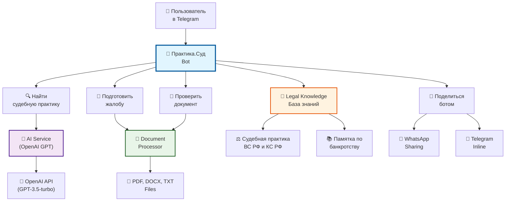

# ⚖️ Практика.Суд - AI Telegram Bot

<div align="center">


**🚀 Революционный AI-бот для юридической помощи**

*Найдите судебную практику, подготовьте жалобы и проверьте документы с помощью искусственного интеллекта*

[🤖 Попробовать бота](https://t.me/dimon82juris_bot) | [📚 Документация](#-установка) | [🚀 Развертывание](#-развертывание) | [☕ Поддержать](https://buymeacoffee.com/whomever)

</div>

---

## 🌟 Возможности

<table>
<tr>
<td align="center" width="25%">

<br><b>🔍 Поиск практики</b>
<br>Анализ ситуации и поиск релевантной судебной практики
</td>
<td align="center" width="25%">

<br><b>📝 Подготовка жалоб</b>
<br>Генерация апелляционных и кассационных жалоб
</td>
<td align="center" width="25%">

<br><b>📄 Проверка документов</b>
<br>Анализ на ошибки и юридические риски
</td>
<td align="center" width="25%">

<br><b>📢 Поделиться</b>
<br>WhatsApp и Telegram интеграция
</td>
</tr>
</table>

## 🏗️ Архитектура проекта



## 📂 Структура проекта

```
ai-law-assistant/
│
├── 🤖 main.py                    # Основной файл бота
├── 🧠 ai_service.py             # Сервис для работы с OpenAI API
├── 📄 document_processor.py      # Обработчик документов (PDF, DOCX, TXT)
├── 💾 legal_knowledge.py        # База юридических знаний
├── ⚙️ config.py                 # Конфигурация проекта
├── 📦 requirements.txt          # Зависимости Python
├── 🚀 deploy.sh                 # Скрипт автоматического деплоя
├── 🖥️ start_bot.bat             # Запуск на Windows
├── 🐧 start_bot.sh              # Запуск на Linux
├── 📖 INSTALL.md                # Инструкции по установке
├── 📋 PROJECT_SUMMARY.md        # Описание проекта
├── 🗂️ DEPLOY_INSTRUCTIONS.md    # Инструкции по деплою
└── 📄 .env.example              # Пример переменных окружения
```

## 🛠️ Технологии

<div align="center">

| Категория | Технологии |
|-----------|------------|
| **🐍 Backend** | Python 3.8+, asyncio, aiogram 3.4.1 |
| **🤖 AI/ML** | OpenAI GPT-3.5-turbo, OpenAI API |
| **📄 Обработка документов** | PyMuPDF, python-docx, текстовые файлы |
| **💾 База данных** | In-memory (FSM), JSON конфигурация |
| **🔧 Инструменты** | systemd, tar, bash scripting |
| **☁️ Деплой** | Linux VPS, Ubuntu 22.04, systemd services |

</div>

## 🚀 Быстрый старт

### 1. Клонирование репозитория

```bash
git clone https://github.com/Wh0mever/ai-law-assistant.git
cd ai-law-assistant
```

### 2. Установка зависимостей

```bash
# Создание виртуального окружения
python3 -m venv venv
source venv/bin/activate  # Linux/Mac
# или
venv\Scripts\activate     # Windows

# Установка пакетов
pip install -r requirements.txt
```

### 3. Настройка переменных окружения

```bash
# Копируйте пример и заполните реальными значениями
cp .env.example .env
nano .env
```

```env
# Токен Telegram бота (получить у @BotFather)
BOT_TOKEN=your_bot_token_here

# OpenAI API ключ (получить на https://platform.openai.com/)
OPENAI_API_KEY=sk-proj-your_openai_api_key_here
```

### 4. Запуск бота

```bash
# Разработка
python main.py

# Продакшн (Linux)
chmod +x start_bot.sh
./start_bot.sh

# Продакшн (Windows)
start_bot.bat
```

## 📱 Интерфейс бота

<div align="center">

### Главное меню
```
🔍 Найти судебную практику
📝 Подготовить жалобу  
📄 Проверить документ
📢 Поделиться ботом
```

### Поиск судебной практики
```
👤 Пользователь: "Меня уволили без приказа, хочу восстановиться на работе"

🤖 Бот: "📋 Анализ вашей ситуации:

⚖️ СУДЕБНАЯ ПРАКТИКА ПО ВОССТАНОВЛЕНИЮ НА РАБОТЕ

🔍 Ваша ситуация относится к трудовым спорам...
[Подробный анализ с ссылками на судебную практику]"
```

</div>

## 🔧 Развертывание на сервере

### Автоматическое развертывание

```bash
# Скачайте и запустите скрипт автоматического деплоя
curl -O https://raw.githubusercontent.com/Wh0mever/ai-law-assistant/main/deploy.sh
chmod +x deploy.sh
./deploy.sh
```

### Ручное развертывание

```bash
# 1. Подготовка сервера
apt update && apt upgrade -y
apt install python3 python3-pip python3-venv -y

# 2. Клонирование проекта
git clone https://github.com/Wh0mever/ai-law-assistant.git
cd ai-law-assistant

# 3. Настройка виртуального окружения
python3 -m venv venv
source venv/bin/activate
pip install -r requirements.txt

# 4. Настройка systemd сервиса
sudo cp praktika-sud.service /etc/systemd/system/
sudo systemctl enable praktika-sud.service
sudo systemctl start praktika-sud.service
```

## 📊 Возможности AI

### 🔍 Анализ судебной практики
- Поиск релевантных дел по описанию ситуации
- Анализ позиций Верховного и Конституционного судов РФ
- Рекомендации по стратегии защиты

### 📝 Генерация документов
- Апелляционные жалобы
- Кассационные жалобы  
- Отзывы на иски
- Процессуальные документы

### 📄 Проверка документов
- Анализ на юридические ошибки
- Выявление процессуальных нарушений
- Рекомендации по улучшению

## 🤝 Сценарии использования

<table>
<tr>
<td><b>👨‍💼 Юристы</b></td>
<td>Быстрый поиск практики, подготовка жалоб, проверка документов</td>
</tr>
<tr>
<td><b>👨‍⚖️ Граждане</b></td>
<td>Получение юридической помощи, консультации по спорам</td>
</tr>
<tr>
<td><b>🏢 Компании</b></td>
<td>Анализ договоров, подготовка процессуальных документов</td>
</tr>
<tr>
<td><b>🎓 Студенты</b></td>
<td>Изучение судебной практики, примеры документов</td>
</tr>
</table>

## 📈 Статистика

<div align="center">


</div>

## 🆘 Поддержка

- 📚 [Документация](INSTALL.md)
- 🐛 [Сообщить об ошибке](https://github.com/Wh0mever/ai-law-assistant/issues)
- 💡 [Предложить улучшение](https://github.com/Wh0mever/ai-law-assistant/issues)
- ☕ [Поддержать проект](https://buymeacoffee.com/whomever)
- 💬 Telegram: [@whomever_support](https://t.me/whomever_support)

## 👥 Команда

<div align="center">

| Роль | Имя | Контакт |
|------|-----|---------|
| 🧠 AI Developer | Wh0mever | [@Wh0mever](https://github.com/Wh0mever) |
| ⚖️ Legal Expert | Wh0mever | [@whomever_support](https://t.me/whomever_support) |
| 🔧 DevOps | Wh0mever | [☕ Buy Me Coffee](https://buymeacoffee.com/whomever) |

</div>

## 📄 Лицензия

Этот проект лицензируется под [MIT License](LICENSE) - подробности см. в файле LICENSE.

## 🌟 Roadmap

- [ ] 🔄 Интеграция с базами данных судебных решений
- [ ] 📊 Аналитика эффективности рекомендаций
- [ ] 🌐 Web-интерфейс для управления
- [ ] 📱 Мобильное приложение
- [ ] 🔗 API для интеграции с другими системами
- [ ] 🤖 Поддержка GPT-4 и других моделей
- [ ] 🌍 Международная судебная практика

---

<div align="center">

**⭐ Поставьте звезду, если проект был полезен!**

*Сделано с ❤️ для юридического сообщества*

[🤖 Попробовать бота](https://t.me/dimon82juris_bot) | 
[📖 Документация](INSTALL.md) | 
[🚀 Развернуть](DEPLOY_INSTRUCTIONS.md) |
[☕ Поддержать](https://buymeacoffee.com/whomever)

</div> 