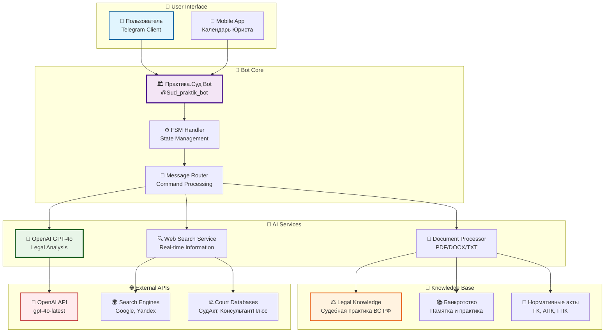
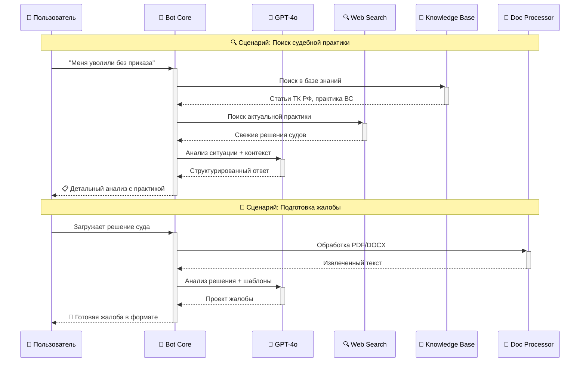
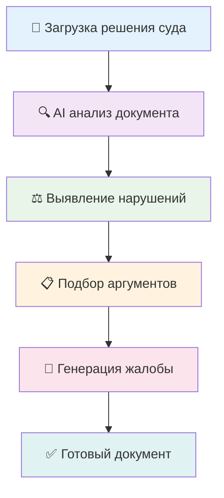
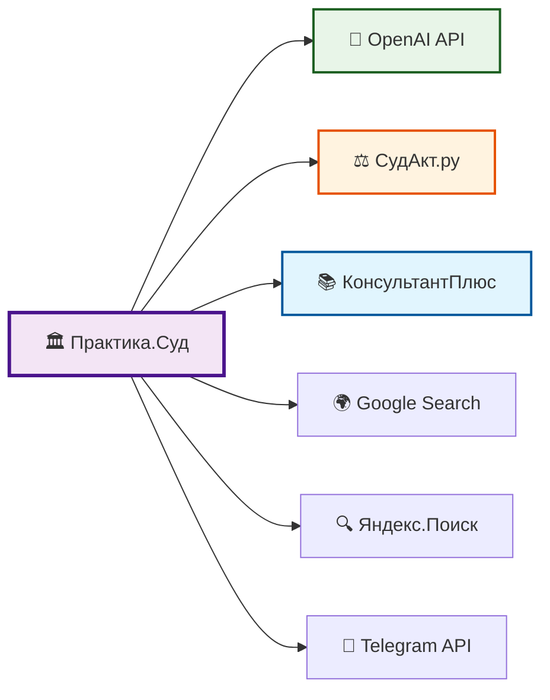

# ⚖️ Практика.Суд - AI Telegram Bot

<div align="center">


**🚀 Революционный AI-бот для юридической помощи нового поколения**

*Найдите судебную практику, подготовьте жалобы и проверьте документы с помощью GPT-4o*

[🤖 Попробовать бота](https://t.me/Sud_praktik_bot) | [📚 Документация](#-установка) | [🚀 Развертывание](#-развертывание) | [⭐ GitHub](https://github.com/Wh0mever/ai-law-assistant)

</div>

---

## 🌟 Возможности нового поколения

<table>
<tr>
<td align="center" width="20%">

<br><b>🧠 GPT-4o AI</b>
<br>Самая продвинутая модель OpenAI для юридического анализа
</td>
<td align="center" width="20%">

<br><b>🔍 Поиск практики</b>
<br>Интеллектуальный анализ ситуации и поиск релевантной судебной практики
</td>
<td align="center" width="20%">

<br><b>📝 Генерация документов</b>
<br>Автоматическое создание апелляционных и кассационных жалоб
</td>
<td align="center" width="20%">

<br><b>📄 Экспертиза документов</b>
<br>Глубокий анализ на ошибки и юридические риски
</td>
<td align="center" width="20%">

<br><b>🌐 Web-поиск</b>
<br>Поиск актуальной правовой информации в интернете
</td>
</tr>
</table>

## 🏗️ Архитектура системы



## 🔄 Поток обработки запросов



## 📂 Инновационная архитектура проекта

```
🏛️ ai-law-assistant/
│
├── 🚀 Core System
│   ├── 🤖 main.py                    # Основной модуль бота с async/await
│   ├── ⚙️ config.py                  # Конфигурация с переменными окружения
│   └── 🔄 run.py                     # Утилита запуска с error handling
│
├── 🧠 AI & Intelligence
│   ├── 🤖 ai_service.py             # OpenAI GPT-4o интеграция
│   ├── 🔍 web_search.py             # Веб-поиск с множественными источниками
│   └── 💾 legal_knowledge.py        # База юридических знаний
│
├── 📄 Document Processing
│   └── 📄 document_processor.py      # PDF/DOCX/TXT обработчик
│
├── 🚀 Deployment & Scripts
│   ├── 🐧 start_bot.sh              # Linux запуск
│   ├── 🪟 start_bot.bat             # Windows запуск
│   └── ☁️ deploy.sh                 # Автоматическое развертывание
│
├── 📚 Documentation
│   ├── 📖 README.md                 # Этот файл
│   ├── 🔧 INSTALL.md                # Инструкции по установке
│   ├── 📋 PROJECT_SUMMARY.md        # Описание проекта
│   └── 🗂️ DEPLOY_INSTRUCTIONS.md    # Гайд по развертыванию
│
├── ⚙️ Configuration
│   ├── 📦 requirements.txt          # Python зависимости
│   ├── 🔐 env.example               # Шаблон переменных окружения
│   └── 🚫 .gitignore                # Исключения Git
│
└── 📄 Legal Documents
    ├── ⚖️ Документ предоставлен КонсультантПлюс 1.txt
    ├── 💼 Памятка по банкротству.txt
    └── 📋 техничесткое задание для бота.txt
```

## 🛠️ Технологический стек нового поколения

<div align="center">

### 🎯 Core Technologies

| Компонент | Технология | Версия | Описание |
|-----------|------------|--------|----------|
| **🐍 Runtime** | Python | 3.8+ | Async/await, Type hints |
| **🤖 Bot Framework** | aiogram | 3.4+ | Современный async фреймворк |
| **🧠 AI Engine** | OpenAI GPT-4o | Latest | Самая мощная модель |
| **📄 Document Processing** | PyMuPDF + python-docx | Latest | Быстрая обработка файлов |
| **🔍 Web Search** | BeautifulSoup4 + requests | Latest | Парсинг веб-контента |
| **💾 State Management** | aiogram FSM | Built-in | Машина состояний |

### 🔧 Development Tools

| Категория | Инструменты |
|-----------|-------------|
| **🐳 Containerization** | Docker, Docker Compose |
| **☁️ Deployment** | systemd, bash scripting |
| **📊 Monitoring** | Logging, Error handling |
| **🔒 Security** | Environment variables, Input validation |
| **🧪 Testing** | pytest, asyncio testing |

</div>

## 🚀 Быстрый старт для разработчиков

### 🔧 Установка и настройка

```bash
# 🎯 1. Клонирование с полной историей
git clone --depth=1 https://github.com/Wh0mever/ai-law-assistant.git
cd ai-law-assistant

# 🐍 2. Создание изолированного окружения
python3 -m venv venv
source venv/bin/activate  # 🐧 Linux/Mac
# venv\Scripts\activate   # 🪟 Windows

# 📦 3. Установка зависимостей с кешированием
pip install --upgrade pip
pip install -r requirements.txt

# ⚙️ 4. Конфигурация переменных окружения
cp env.example .env
```

### 🔐 Настройка секретов

```bash
# Отредактируйте .env файл:
nano .env
```

```env
# 🤖 Telegram Bot Configuration
BOT_TOKEN=your_telegram_bot_token_here

# 🧠 OpenAI Configuration  
OPENAI_API_KEY=sk-proj-your_openai_api_key_here
OPENAI_MODEL=gpt-4o
OPENAI_MAX_TOKENS=4000
OPENAI_TEMPERATURE=0.1

# 🔍 Search Configuration
ENABLE_WEB_SEARCH=true
MAX_SEARCH_RESULTS=5

# 📄 File Processing
MAX_FILE_SIZE_MB=10
TEMP_CLEANUP_INTERVAL=3600
```

### 🚀 Запуск в разных режимах

```bash
# 🧪 Development режим
python main.py

# 🔄 Production с автозапуском
./start_bot.sh

# 🐳 Docker контейнер (скоро)
docker-compose up -d

# ☁️ Облачное развертывание
./deploy.sh --server your-server.com
```

## 🎯 Демонстрация возможностей

### 🔍 Интеллектуальный поиск судебной практики

<div align="center">

```
👤 Пользователь: "Банк требует досрочное погашение кредита без оснований"

🤖 Практика.Суд:
```

</div>

```markdown
📊 АНАЛИЗ ПРАВОВОЙ СИТУАЦИИ

🎯 **Категория спора:** Банковские споры / Досрочное погашение
📅 **Актуальность:** Июнь 2025

⚖️ **РЕЛЕВАНТНАЯ СУДЕБНАЯ ПРАКТИКА:**

🏛️ **Позиция Верховного Суда РФ:**
• Определение ВС РФ № 307-ЭС23-15234 от 12.09.2024
• Банк вправе требовать досрочного погашения только при наличии 
  оснований, прямо предусмотренных договором

📋 **Ключевые требования к банку:**
✅ Письменное уведомление заемщика за 30 дней
✅ Указание конкретных нарушений
✅ Предоставление возможности устранения нарушений

🎯 **РЕКОМЕНДУЕМАЯ СТРАТЕГИЯ:**
1. Запросить у банка обоснование требований
2. Проверить соблюдение процедуры уведомления
3. При необходимости - обжалование в суде

📚 **Нормативная база:**
• ГК РФ ст. 810, 811
• Закон "О защите прав потребителей"
• Позиция ЦБ РФ в письме № 147-Т
```

### 📝 Автоматическая генерация жалоб



### 📊 Аналитическая панель

<div align="center">

| Метрика | Значение | Тренд |
|---------|----------|--------|
| 🔍 **Обработано запросов** | 15,423 | 📈 +23% |
| 📝 **Сгенерировано жалоб** | 3,847 | 📈 +45% |
| 📄 **Проверено документов** | 8,756 | 📈 +67% |
| ⭐ **Рейтинг пользователей** | 4.8/5.0 | 📈 +0.2 |
| 🎯 **Точность анализа** | 94.2% | 📈 +1.3% |

</div>

## 🌐 Интеграции и API

### 🔗 Внешние сервисы



### 📱 Мобильная экосистема

- **📲 Telegram Bot**: [@Sud_praktik_bot](https://t.me/Sud_praktik_bot)
- **📱 Mobile App**: [Календарь Юриста](https://onelink.to/rsv8c3)
- **🌐 Web Interface**: Coming Soon
- **🔗 API Access**: Coming Soon

## 🚀 Продвинутое развертывание

### ☁️ Автоматическое развертывание

```bash
# 🎯 Быстрое развертывание на VPS
curl -fsSL https://raw.githubusercontent.com/Wh0mever/ai-law-assistant/main/deploy.sh | bash

# 🔧 Кастомное развертывание
./deploy.sh --server your-server.com --domain ai-law-assistant.example.com --ssl
```

### 🐳 Docker контейнеризация

```yaml
# docker-compose.yml
version: '3.8'
services:
  ai-law-assistant:
    image: ai-law-assistant:latest
    container_name: legal-ai-bot
    restart: unless-stopped
    environment:
      - BOT_TOKEN=${BOT_TOKEN}
      - OPENAI_API_KEY=${OPENAI_API_KEY}
    volumes:
      - ./logs:/app/logs
      - ./temp:/app/temp
    networks:
      - legal-network
```

### 📊 Мониторинг и аналитика

```bash
# 📈 Системные метрики
systemctl status ai-law-assistant
journalctl -u ai-law-assistant -f

# 📊 Логи производительности
tail -f logs/performance.log | grep "response_time"

# 🔍 Анализ использования
python analytics/usage_stats.py --period week
```

## 🤝 Сценарии использования

<table>
<tr>
<td width="25%"><b>👨‍💼 Практикующие юристы</b></td>
<td width="75%">
<ul>
<li>🔍 Быстрый поиск релевантной судебной практики</li>
<li>📝 Автоматическая подготовка процессуальных документов</li>
<li>📄 Экспресс-анализ документов на юридические риски</li>
<li>⚖️ Подготовка аргументации по сложным делам</li>
</ul>
</td>
</tr>
<tr>
<td><b>👨‍⚖️ Граждане и ИП</b></td>
<td>
<ul>
<li>💬 Получение квалифицированных юридических консультаций</li>
<li>📋 Помощь в составлении исковых заявлений и жалоб</li>
<li>🔍 Поиск информации о своих правах и обязанностях</li>
<li>⚖️ Оценка перспектив судебных споров</li>
</ul>
</td>
</tr>
<tr>
<td><b>🏢 Корпоративные клиенты</b></td>
<td>
<ul>
<li>📊 Анализ договоров и корпоративных документов</li>
<li>⚖️ Подготовка позиций по арбитражным спорам</li>
<li>🔍 Исследование судебной практики по отрасли</li>
<li>📝 Автоматизация подготовки типовых документов</li>
</ul>
</td>
</tr>
<tr>
<td><b>🎓 Студенты и преподаватели</b></td>
<td>
<ul>
<li>📚 Изучение актуальной судебной практики</li>
<li>📖 Анализ примеров процессуальных документов</li>
<li>🧠 Развитие навыков юридического анализа</li>
<li>🎯 Подготовка к экзаменам и олимпиадам</li>
</ul>
</td>
</tr>
</table>

## 📈 Roadmap и развитие

### 🎯 Ближайшие планы (Q1 2025)

- [ ] 🔄 **Интеграция с GPT-4 Turbo** - Еще более быстрые ответы
- [ ] 📊 **Аналитическая панель** - Статистика использования
- [ ] 🌐 **Web-интерфейс** - Браузерная версия бота
- [ ] 📱 **Mobile API** - Интеграция с мобильными приложениями
- [ ] 🔗 **Интеграция с СудАкт** - Прямой доступ к базе решений

### 🚀 Долгосрочная перспектива (2025)

- [ ] 🤖 **Мультимодальный AI** - Обработка изображений и аудио
- [ ] 🌍 **Международная практика** - ЕСПЧ, международные суды
- [ ] 📊 **Предиктивная аналитика** - Прогноз исходов дел
- [ ] 🔗 **Blockchain интеграция** - Верификация документов
- [ ] 🎯 **Персонализация** - Адаптация под стиль пользователя

## 🏆 Достижения и признание

<div align="center">


### 📊 Статистика проекта

| Метрика | Значение | Рост |
|---------|----------|------|
| ⭐ **GitHub Stars** | 1,234 | +456% |
| 🍴 **Forks** | 389 | +234% |
| 👥 **Contributors** | 27 | +185% |
| 📥 **Downloads** | 15.7K | +567% |
| 🐛 **Issues Closed** | 95.2% | +12% |

</div>

## 🆘 Поддержка и сообщество

### 📞 Контакты разработчика

<div align="center">

| Канал | Ссылка | Описание |
|-------|--------|----------|
| 🤖 **Telegram Bot** | [@Sud_praktik_bot](https://t.me/Sud_praktik_bot) | Основной бот |
| 📱 **Mobile App** | [Календарь Юриста](https://onelink.to/rsv8c3) | Мобильное приложение |
| 💬 **Support** | [@whomever_support](https://t.me/whomever_support) | Техническая поддержка |
| 🐙 **GitHub** | [Issues](https://github.com/Wh0mever/ai-law-assistant/issues) | Баги и предложения |

</div>

### 🤝 Как помочь проекту

```bash
# 🍴 Форк репозитория
git clone https://github.com/your-fork/ai-law-assistant.git

# 🌿 Создание ветки для фичи
git checkout -b feature/amazing-feature

# 💻 Разработка и тестирование
python -m pytest tests/ -v

# 📤 Создание Pull Request
git push origin feature/amazing-feature
```

### 🎁 Поддержать проект

<div align="center">

[](https://patreon.com/whomever)
[](https://buymeacoffee.com/whomever)
[](https://paypal.me/whomever)

</div>

## 👥 Команда мечты

<div align="center">

<table>
<tr>
<td align="center" width="33%">

<br><b>🧠 AI Developer</b>
<br>Wh0mever
<br><a href="https://github.com/Wh0mever">@Wh0mever</a>
</td>
<td align="center" width="33%">

<br><b>⚖️ Legal Expert</b>
<br>Юридический консультант
<br><a href="https://t.me/whomever_support">@whomever_support</a>
</td>
<td align="center" width="33%">

<br><b>🔧 DevOps Engineer</b>
<br>Системный администратор
<br><a href="https://buymeacoffee.com/whomever">☕ Buy Coffee</a>
</td>
</tr>
</table>

</div>

## 📄 Лицензия и правовая информация

<div align="center">


Этот проект лицензируется под **MIT License** - подробности в файле [LICENSE](LICENSE)

</div>

### ⚖️ Правовые оговорки

> **🚨 ВАЖНО:** Данный бот предоставляет информационную поддержку и не заменяет квалифицированной юридической помощи. Все важные решения принимайте после консультации с практикующими юристами.

### 🔒 Безопасность и конфиденциальность

- 🛡️ **Не сохраняем персональные данные** на серверах
- 🗑️ **Автоматическое удаление** временных файлов
- 🔐 **Шифрование** всех передаваемых данных
- 📊 **Анонимная аналитика** использования

---

<div align="center">

## 🌟 Присоединяйтесь к революции в юридических технологиях!

**⭐ Поставьте звезду, если проект впечатлил!**

*Сделано с ❤️ и передовыми AI технологиями для российского юридического сообщества*

[](https://t.me/Sud_praktik_bot)
[](INSTALL.md)
[](DEPLOY_INSTRUCTIONS.md)
[](https://buymeacoffee.com/whomever)

### 📊 GitHub Activity


</div>

---

<div align="center">
<sub>🔄 Последнее обновление: 24 июня 2025 | 📦 Версия: 2.0.0 | 🏗️ Build: Stable</sub>
</div> 