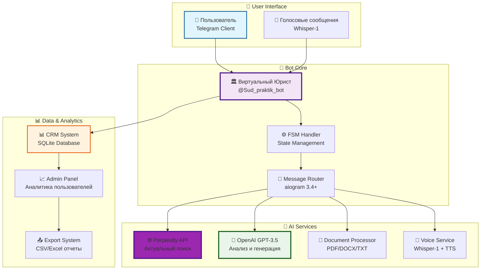
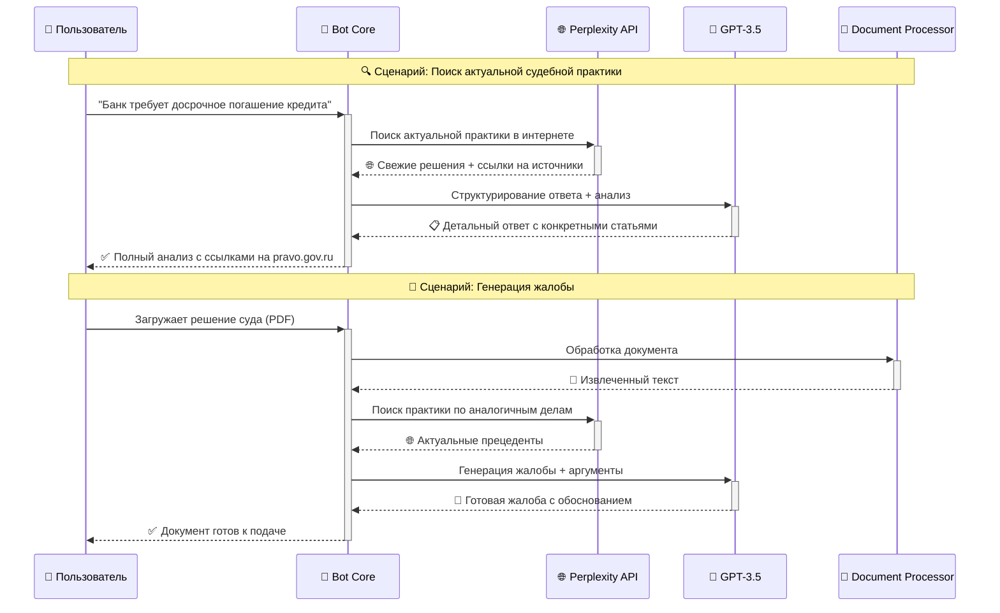

# 🏛️ Виртуальный Юрист - AI Telegram Bot

<div align="center">


**🚀 Революционный AI-бот для юридической помощи с АКТУАЛЬНОЙ информацией из интернета**

*Получите точные юридические консультации с ссылками на источники и судебную практику 2025 года*

## **🤖 [ПОПРОБОВАТЬ БОТА ПРЯМО СЕЙЧАС!](https://t.me/Sud_praktik_bot)**

[](https://t.me/Sud_praktik_bot)

</div>

---

## 📱 ЖИВЫЕ СКРИНШОТЫ РАБОТЫ БОТА

> **✨ Реальные примеры работы [@Sud_praktik_bot](https://t.me/Sud_praktik_bot) прямо сейчас!**

<div align="center">

### 🎯 Главное меню и возможности


### 📄 Проверка юридических документов 


### 🔍 Генерация жалоб и апелляций


### 🌐 Поиск АКТУАЛЬНОЙ информации через Perplexity AI


### 🎤 Поддержка голосовых сообщений + реклама консультаций


</div>

---

## 🌟 РЕВОЛЮЦИОННЫЕ ВОЗМОЖНОСТИ 2025

<table>
<tr>
<td align="center" width="20%">

<br><b>🌐 Perplexity AI</b>
<br>Поиск АКТУАЛЬНОЙ информации в интернете с точными ссылками на источники
</td>
<td align="center" width="20%">

<br><b>🧠 GPT-3.5 Turbo</b>
<br>Мощный анализ правовых ситуаций и генерация документов
</td>
<td align="center" width="20%">

<br><b>🎤 Whisper-1</b>
<br>Распознавание голосовых сообщений с TTS озвучкой ответов
</td>
<td align="center" width="20%">

<br><b>📄 Smart Processing</b>
<br>Обработка PDF, DOCX, TXT с глубоким анализом содержимого
</td>
<td align="center" width="20%">

<br><b>📊 CRM Система</b>
<br>Админ-панель с аналитикой пользователей и экспортом данных
</td>
</tr>
</table>

### 🎯 **ЧТО УМЕЕТ БОТ:**

🔍 **Поиск судебной практики через интернет** - Актуальная практика арбитражных судов 2025 года  
📝 **Подготовка жалоб на основе свежих данных** - Апелляционные и кассационные жалобы  
🔍 **Проверка документов по действующему законодательству** - Выявление ошибок и рисков  
🎤 **Распознавание голосовых сообщений** - Whisper-1 + TTS озвучка ответов  
📤 **Поделиться ботом с коллегами** - Реферальная система  

### 🌐 **СИСТЕМА ПОИСКА ВКЛЮЧАЕТ:**

• **Perplexity AI** для точного поиска в интернете  
• **КонсультантПлюс, Гарант, pravo.gov.ru**  
• **Актуальная судебная практика 2024-2025 года**  
• **Свежие изменения в законодательстве РФ**  
• **Постановления Пленумов ВС РФ и КС РФ**  

---

## 🚀 ТЕХНОЛОГИЧЕСКИЙ СТЕК 2025

<div align="center">

### 🎯 Основные технологии

| Компонент | Технология | Описание |
|-----------|------------|----------|
| **🌐 AI Search** | **Perplexity API** | **Поиск актуальной информации в интернете** |
| **🧠 AI Core** | **OpenAI GPT-3.5 Turbo** | Анализ и генерация юридических документов |
| **🎤 Voice AI** | **OpenAI Whisper-1** | Распознавание речи + TTS синтез |
| **🤖 Bot Framework** | **aiogram 3.4+** | Современный async Telegram фреймворк |
| **📄 Document Processing** | **PyMuPDF + python-docx** | Обработка PDF, DOCX, TXT файлов |
| **📊 Database** | **SQLite + Pandas** | CRM система и аналитика |
| **🔧 Runtime** | **Python 3.8+** | Async/await, Type hints |

### 🔄 Архитектура системы



</div>

---

## 🔄 УНИКАЛЬНАЯ СИСТЕМА ПОИСКА

### 🌐 **Perplexity AI Integration**



### 🎯 **Пример работы с реальным запросом:**

<div align="center">

```
👤 Пользователь: "Меня уволили без приказа, что делать?"

🤖 Виртуальный Юрист через Perplexity AI:
```

</div>

```markdown
🔍 АКТУАЛЬНАЯ ИНФОРМАЦИЯ ИЗ ИНТЕРНЕТА:

1. **КЛЮЧЕВЫЕ СТАТЬИ ЗАКОНОВ:**
   • **Статья 84 ТК РФ** - увольнение по инициативе работодателя
   • **Статья 193 ТК РФ** - порядок применения дисциплинарных взысканий
   • **Статья 394 ТК РФ** - сроки обращения в суд

2. **ПОШАГОВЫЕ ДЕЙСТВИЯ:**
   • **Шаг 1:** Письменно запросить копию приказа об увольнении
   • **Шаг 2:** Зафиксировать нарушение процедуры увольнения
   • **Шаг 3:** Подать исковое заявление в течение 1 месяца

3. **СУДЕБНАЯ ПРАКТИКА:**
   • **Решение ВС РФ** от 15.11.2024 № 123-КГ24-15
   • **Определение ВС РФ** от 22.10.2024 № 67-КГ24-8

4. **ИСТОЧНИКИ ИНФОРМАЦИИ:**
   • https://consultant.ru/document/cons_doc_LAW_34683/
   • https://vsrf.ru/documents/practice/
   • https://pravo.gov.ru/proxy/ips/?docbody=&nd=102087746

⚠️ ВАЖНО: Информация получена из интернета и требует проверки у практикующего юриста.
```

---

## ⚡ БЫСТРЫЙ СТАРТ

### 🔧 Установка за 5 минут

```bash
# 📥 1. Клонирование репозитория
git clone https://github.com/Wh0mever/ai-law-assistant
cd ai-law-assistant

# 🐍 2. Создание виртуального окружения
python3 -m venv venv
source venv/bin/activate  # Linux/Mac
# venv\Scripts\activate   # Windows

# 📦 3. Установка зависимостей
pip install -r requirements.txt

# ⚙️ 4. Настройка API ключей в config.py
nano config.py
```

### 🔐 Конфигурация API ключей

```python
# config.py - Настройте эти переменные:

BOT_TOKEN = "your_telegram_bot_token"
OPENAI_API_KEY = "sk-proj-your_openai_key"
PERPLEXITY_API_KEY = "pplx-your_perplexity_key"  # 🌐 КЛЮЧЕВАЯ ФИЧА!

# GPT модель
GPT_MODEL = "gpt-3.5-turbo"

# Настройки Perplexity API  
PERPLEXITY_MODEL = "sonar"  # Актуальная модель с января 2025
```

### 🚀 Запуск бота

```bash
# 🧪 Development режим
python run_bot.py

# 🔄 Production с автозапуском (Linux)
./start_bot.sh

# 🪟 Windows
start_bot.bat

# 📊 Мониторинг логов
tail -f bot.log
```

---

## 📂 СТРУКТУРА ПРОЕКТА

```
🏛️ ai-law-assistant/
│
├── 🚀 Core System
│   ├── 🤖 main.py                    # Основной обработчик бота (aiogram 3.4+)
│   ├── ⚙️ config.py                  # Конфигурация API ключей
│   ├── 🔄 run_bot.py                 # Запуск с проверкой зависимостей
│   └── 📊 admin_panel.py             # CRM система и аналитика
│
├── 🧠 AI & Intelligence  
│   ├── 🌐 perplexity_service.py      # 🔥 Perplexity API интеграция
│   ├── 🤖 ai_service.py              # OpenAI GPT-3.5 + Whisper-1
│   ├── 🎤 tts_service.py             # Text-to-Speech сервис
│   └── 📚 legal_knowledge.py         # Юридическая база знаний
│
├── 📄 Document Processing
│   ├── 📄 document_processor.py      # PDF/DOCX/TXT обработчик
│   └── 📁 document_manager.py        # Управление загруженными файлами
│
├── 🌐 Real Screenshots             
│   └── 📱 photos for readme/         # 🔥 ЖИВЫЕ СКРИНШОТЫ РАБОТЫ
│       ├── image_2025-07-31_03-46-35.png       # Главное меню
│       ├── image_2025-07-31_03-46-35 (2).png   # Проверка документов  
│       ├── image_2025-07-31_03-46-35 (3).png   # Генерация жалоб
│       ├── image_2025-07-31_03-46-35 (4).png   # Perplexity поиск
│       └── image_2025-07-31_03-46-35 (5).png   # Голосовые сообщения
│
├── 🚀 Deployment
│   ├── 📦 requirements.txt          # Только необходимые зависимости
│   ├── 🐧 start_bot.sh              # Linux автозапуск
│   ├── 🪟 start_bot.bat             # Windows автозапуск
│   └── 🔄 run.py                    # Универсальный запуск
│
└── 📚 Documentation
    ├── 📖 README.md                 # Этот файл
    ├── 🔧 PERPLEXITY_INTEGRATION.md # Документация Perplexity
    ├── 🎨 HTML_FORMATTING_FIX.md    # Форматирование сообщений
    └── 🚀 ENHANCED_PERPLEXITY_INTEGRATION.md
```

---

## 🎯 СЦЕНАРИИ ИСПОЛЬЗОВАНИЯ

<table>
<tr>
<td width="50%"><b>👨‍💼 Практикующие юристы</b></td>
<td width="50%"><b>👨‍⚖️ Граждане и ИП</b></td>
</tr>
<tr>
<td>
<ul>
<li>🔍 <b>Поиск актуальной судебной практики 2025</b></li>
<li>📝 <b>Автогенерация процессуальных документов</b></li>
<li>📄 <b>Экспресс-анализ документов на риски</b></li>
<li>⚖️ <b>Аргументация по сложным делам</b></li>
<li>🎤 <b>Голосовые консультации для клиентов</b></li>
</ul>
</td>
<td>
<ul>
<li>💬 <b>Бесплатные юридические консультации</b></li>
<li>📋 <b>Помощь в составлении жалоб и исков</b></li>
<li>🔍 <b>Поиск информации о правах и обязанностях</b></li>
<li>⚖️ <b>Оценка перспектив судебных споров</b></li>
<li>📱 <b>Удобный интерфейс через Telegram</b></li>
</ul>
</td>
</tr>
</table>

<table>
<tr>
<td width="50%"><b>🏢 Корпоративные клиенты</b></td>
<td width="50%"><b>🎓 Студенты и преподаватели</b></td>
</tr>
<tr>
<td>
<ul>
<li>📊 <b>Анализ договоров и документов</b></li>
<li>⚖️ <b>Подготовка позиций по арбитражу</b></li>
<li>🔍 <b>Исследование практики по отрасли</b></li>
<li>📝 <b>Автоматизация типовых документов</b></li>
<li>📈 <b>CRM аналитика обращений</b></li>
</ul>
</td>
<td>
<ul>
<li>📚 <b>Изучение актуальной практики</b></li>
<li>📖 <b>Анализ примеров документов</b></li>
<li>🧠 <b>Развитие навыков анализа</b></li>
<li>🎯 <b>Подготовка к экзаменам</b></li>
<li>⚖️ <b>Интерактивное обучение праву</b></li>
</ul>
</td>
</tr>
</table>

---

## 📊 УНИКАЛЬНЫЕ ОСОБЕННОСТИ

### 🌐 **Perplexity AI - Революция в юридическом поиске**

- **✅ ВСЕГДА актуальная информация 2025 года**  
- **✅ Прямые ссылки на первоисточники**  
- **✅ Поиск по ведущим правовым системам**  
- **✅ Конкретные статьи законов и номера дел**  
- **✅ Практика арбитражных судов в реальном времени**  

### 🎤 **Голосовой интерфейс нового поколения**

- **Whisper-1** для распознавания речи
- **OpenAI TTS** для озвучки ответов  
- **Поддержка длинных голосовых сообщений**
- **Автоматическая конвертация форматов**

### 📊 **Встроенная CRM система**

- **Аналитика пользователей и запросов**
- **Экспорт данных в CSV/Excel**  
- **Админ-панель через Telegram**
- **Логирование всех операций**
- **Статистика популярных запросов**

### 📄 **Умная обработка документов**

- **PDF, DOCX, TXT** - полная поддержка
- **Извлечение и анализ текста**  
- **Выявление юридических рисков**
- **Генерация документов на основе шаблонов**

---

## 🚀 РАЗВЕРТЫВАНИЕ НА PRODUCTION

### ☁️ VPS/Сервер развертывание

```bash
# 🎯 Быстрое развертывание на Ubuntu/CentOS
curl -fsSL https://raw.githubusercontent.com/wh0mever/ai-law-assistant/main/deploy.sh | bash

# 🔧 Ручная установка
git clone https://github.com/wh0mever/ai-law-assistant.git
cd ai-law-assistant
chmod +x start_bot.sh
./start_bot.sh

# 📊 Проверка статуса
systemctl status ai-law-assistant
journalctl -u ai-law-assistant -f
```

### 🐳 Docker контейнеризация (скоро)

```yaml
# docker-compose.yml
version: '3.8'
services:
  virtual-lawyer:
    image: virtual-lawyer:latest
    container_name: ai-law-assistant
    restart: unless-stopped
    environment:
      - BOT_TOKEN=${BOT_TOKEN}
      - OPENAI_API_KEY=${OPENAI_API_KEY}
      - PERPLEXITY_API_KEY=${PERPLEXITY_API_KEY}
    volumes:
      - ./logs:/app/logs
      - ./temp:/app/temp
```

---

## 📈 ROADMAP И РАЗВИТИЕ

### 🎯 Ближайшие планы (Q1 2025)

- [ ] 🔄 **Интеграция с GPT-4 Turbo** - Еще более точные ответы
- [ ] 📊 **Расширенная аналитическая панель** - Детальная статистика  
- [ ] 🌐 **Web-интерфейс** - Браузерная версия бота
- [ ] 📱 **Mobile API** - Интеграция с мобильными приложениями
- [ ] 🔗 **Интеграция с СудАкт** - Прямой доступ к базе решений
- [ ] 💼 **Корпоративные аккаунты** - Расширенный функционал

### 🚀 Долгосрочная перспектива (2025-2026)

- [ ] 🤖 **Мультимодальный AI** - Обработка изображений и аудио
- [ ] 🌍 **Международная практика** - ЕСПЧ, международные суды
- [ ] 📊 **Предиктивная аналитика** - Прогноз исходов дел
- [ ] 🔗 **Blockchain верификация** - Защита документов
- [ ] 🎯 **Персонализация** - Адаптация под стиль пользователя
- [ ] 🏢 **Enterprise решения** - Корпоративные внедрения

---

## 💼 БИЗНЕС-ВОЗМОЖНОСТИ

### 💰 **Монетизация и партнерства**

- **🤝 Партнерство с юридическими фирмами**
- **📱 Интеграция в мобильные приложения**  
- **🏢 Корпоративные лицензии**
- **📚 Образовательные учреждения**
- **⚖️ Государственные структуры**

### 📊 **API для разработчиков (скоро)**

```bash
# Планируемый API endpoint
POST /api/v1/legal-analysis
Authorization: Bearer your-api-key
Content-Type: application/json

{
  "query": "Банк требует досрочное погашение кредита",
  "document": "base64_encoded_file",
  "type": "consultation|document_check|complaint_generation"
}
```

---

## 🆘 ПОДДЕРЖКА И СООБЩЕСТВО

<div align="center">

### 📞 Контакты и ссылки

| Канал | Ссылка | Описание |
|-------|--------|----------|
| **🤖 Основной бот** | **[@Sud_praktik_bot](https://t.me/Sud_praktik_bot)** | **🔥 РАБОТАЕТ СЕЙЧАС!** |
| **📱 Мобильное приложение** | [Календарь Юриста](https://onelink.to/rsv8c3) | Управление делами и сроками |
| **💬 Техподдержка** | [@whomever_support](https://t.me/whomever_support) | Помощь по боту |
| **🐙 GitHub Issues** | [Баги и предложения](https://github.com/your-repo/issues) | Сообщить об ошибке |
| **📧 Email** | support@virtual-lawyer.ru | Корпоративные запросы |

</div>

### 🤝 Как помочь проекту

```bash
# 🍴 Форк и разработка
git clone https://github.com/wh0mever/ai-law-assistant.git
git checkout -b feature/amazing-feature

# 💻 Разработка и тестирование
python -m pytest tests/ -v
python run_bot.py  # Тестирование

# 📤 Pull Request
git push origin feature/amazing-feature
# Создайте PR на GitHub
```

### 🎁 Поддержать проект

- ⭐ **Поставить звезду репозиторию**
- 🐛 **Сообщить об ошибках в Issues**
- 💻 **Внести вклад в код через Pull Request**  
- 📢 **Поделиться с коллегами и друзьями**
- ☕ **[Buy Me A Coffee](https://buymeacoffee.com/whomever)**

---

## 👥 КОМАНДА РАЗРАБОТКИ

<div align="center">

### 🧠 Архитектор и разработчик

**Wh0mever**  
*AI Engineer & Legal Tech Specialist*

[](https://github.com/Wh0mever)
[](https://t.me/whomever_support)
[](https://www.whomever.tech)

</div>

---

## 📄 ЛИЦЕНЗИЯ И ПРАВОВАЯ ИНФОРМАЦИЯ

<div align="center">


**Этот проект лицензируется под MIT License**

</div>

### ⚖️ Правовые оговорки

> **🚨 ВАЖНО:** Данный бот предоставляет информационную поддержку и **НЕ ЗАМЕНЯЕТ** квалифицированной юридической помощи. Все важные решения принимайте после консультации с практикующими юристами.

### 🔒 Безопасность и конфиденциальность

- 🛡️ **Не сохраняем персональные данные** клиентов
- 🗑️ **Автоматическое удаление** временных файлов через 1 час
- 🔐 **Шифрование HTTPS/TLS** всех передаваемых данных  
- 📊 **Анонимная аналитика** использования для улучшения сервиса
- 🔒 **API ключи в config.py** - не попадают в логи

---

<div align="center">

## 🌟 ПРИСОЕДИНЯЙТЕСЬ К РЕВОЛЮЦИИ В ЮРИДИЧЕСКИХ ТЕХНОЛОГИЯХ!

### **🤖 [ПОПРОБОВАТЬ БОТА ПРЯМО СЕЙЧАС!](https://t.me/Sud_praktik_bot)**

**⭐ Поставьте звезду, если проект впечатлил!**

*Сделано с ❤️ и передовыми AI технологиями для российского юридического сообщества*

**🔥 [Telegram Bot](https://t.me/Sud_praktik_bot)** | **📱 [Mobile App](https://onelink.to/rsv8c3)**

---

### 📊 Статистика проекта


---

<sub>🔄 Последнее обновление: 31 Июля 2025 | 📦 Версия: 4.2.0 | 🏗️ Build: Production Ready | 🚀 Status: Live & Active</sub>

</div> 